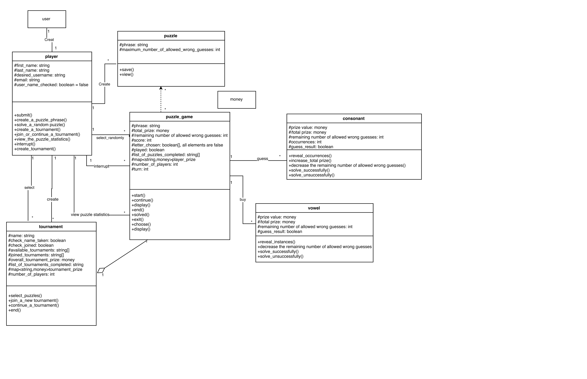
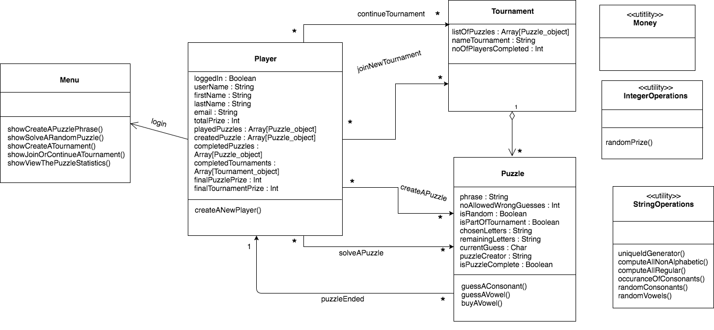
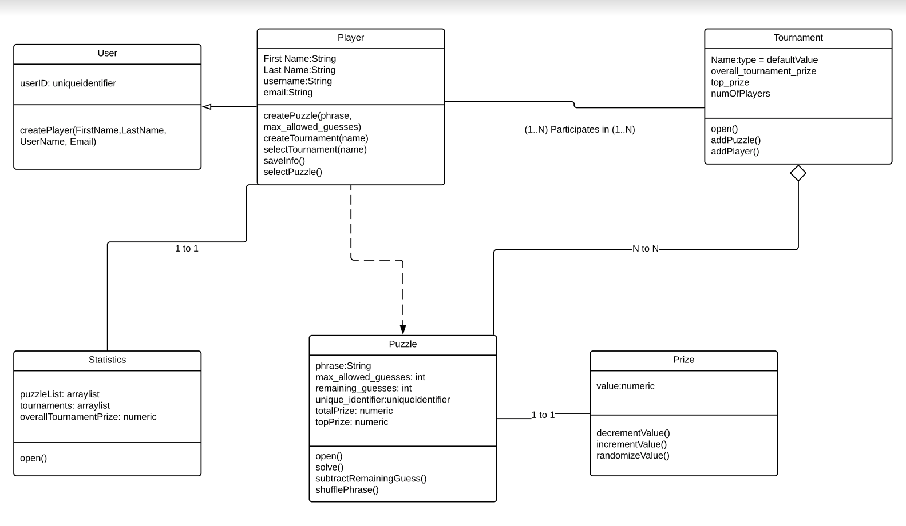
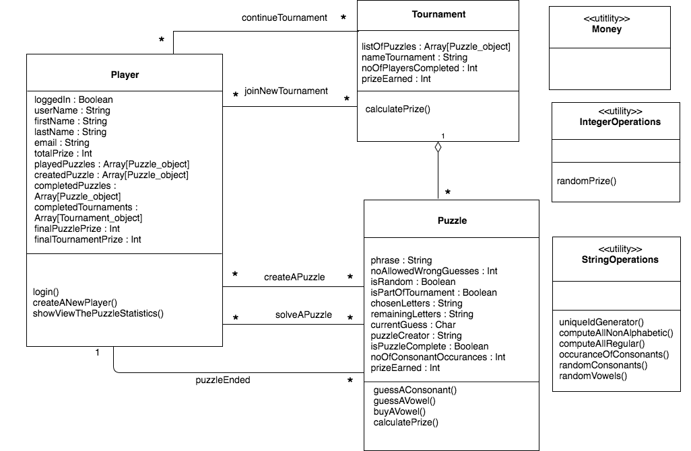

**a.** **Individual designs**

**Design 1:(from ylan35-design.pdf)**

**Pros:** this UML graph includes almost every detail in the
requirements. This UML has player, tournament, puzzle, puzzle\_game,
consonant, and vowel classes. It is clear and easy for people to
understand the whole structures of this game.

**Cons:** Firstly, we don't need vowel and consonant classes. We can
make them as functions in puzzle class. Secondly, it's better to merge
puzzle and puzzle\_game to be one class. Thirdly, we don't need a user
class, the player class can replace with the user class.

**Design 2:(from ahegde39-design.pdf)**

**Pros:** this UML graph is concise and easy for people to understand.
It contains player, tournament, puzzle, menu classes. All the
relationships, attributes and functions are clear. After discussion, we
vote to choose this UML as template to be revised.

**Cons:** Firstly, we don't need menu class which is lengthy. Secondly,
we replace all directed association with association relationship.
Because here, there is no container-contained relationship. Thirdly, we
add more attributes and functions(see Team Design part) to satisfy all
the requirements.

**Design 3:(from mmills40-design.pdf)**

**Pros:** The UML is very concise and clear for people to understand the
structures of this game. The UML contains user, player, puzzle, prize,
statistics and tournament classes which satisfy the requirements.

**Cons:** Firstly, there are some classes that are not needed. We don't
need statistics and prize classes. We can make them as functions and
attributes. Secondly, some relationships are wrong. We need to revise
them. Thirdly, the classes missed some important attributes and
functions.

**b. Team Design**

**The UML before revise:**

**The final version UML:**

1\. **When starting the application, a user may choose to either create a
new player or log in. For simplicity in designing the application, you
should consider the application to run locally; that is, only players on
the same device will be able to share information (e.g., puzzles,
tournaments, scores). In addition, you do not need to consider
authentication or security requirements; that is, a (unique) username
will be sufficient for logging in.**\
\
We have created a class called Player. We have not created a class
called "User" since we have treated each Player as a user. Also we have
not created "Game" class because "Game" is the system we are dealing
with. We have used userName as an attribute/characteristic of a Player
to uniquely identify them and logging in to the application. We have
added a boolean value called isLoggedIn to denote whether Player has to
create new instance or can log in. We have created operations called
createANewPlayer() and login(). We use the attribute isLoggedIn to
denote whether the player is logged in or not. **Also we have added two
more methods i.e login() and showViewThePuzzleStatistics() in Player
class. And we replace all the directional association relationship with association relationship.
Because there is no container-contained relationship**

2. **After logging in, the application shall allow players to (1) create
a puzzle phrase, (2) solve a random puzzle, (3) create a tournament, (4)
join or continue a tournament, and (5) view the puzzle statistics.**\
\
These functions are present in the Player class. It shows the respective
options on the screen when the Player is logged in. If there is no
puzzle or if the Player has already solved all puzzles, or when the
player selects solveARandomPuzzle(), then the GUI element would handle
the error message. If there are no tournaments created by other players
or if the puzzles in the tournament are already solved, then
joinOrContinueATournament() option would throw an error in GUI.
**We also delete menu class, because we don't need menu class which is lengthy and we only need player class.**

3. **The application shall maintain an underlying database to save
persistent information across runs (e.g., players, puzzles, statistics,
tournament information).**

All classes and the attributes persisted in the database are also
present in the design.

4. **When creating a new player, a user will:**\
a. **Enter the player's first name.**\
b. **Enter the player's last name.**\
c. **Enter the player's desired username.**\
d. **Enter the player's email.**\
e. **Submit the information.**\
f. **Either receive a confirmation that the information is saved and
return to the menu**\
or\
**receive an error if the username is already taken on that device and be**\
**offered the option to pick a different username.**\
**A player cannot be edited or deleted after a successful save.**\
\
We have already created a class called Player in (step 1) and created an
operation called createANewPlayer(). We defined the attributes (a)
firstName, (b) lastName, (c) userName and (d) email in Player class.
userName attribute is the one which we have created in step1 to login to
the application. When createANewPlayer function is completed and user
submits the above information(using a GUI element), a confirmation is
shown (GUI). The userName is fetched from the database to check whether
it is already in use or not and a suitable error message "to pick a
different username" is shown if it is in use. After successful save, the
editing and deleting won't be permitted by database.

5. **To create a puzzle, the player will:**\
a.  **Enter a phrase.**\
b.  **Enter the maximum number of allowed wrong guesses a user can make**\
    **before losing the game, between 0 and 10.**\
c.  **Save and view the returned unique identifier for the puzzle. The**\
    **puzzle may not be further edited after this point.**\
\
We have created a class called Puzzle. It contains the attribute (a)
phrase as string, (b) noAllowedWrongGuesses as int, (c) uniqueIdentifier
as string. After entering the phrase and noAllowedWrongGuesses
information, the identifier is generated (by a function
uniqueIdGenerator() utility class called StringOperations). The GUI
enables the user to view the returned id. After successful save, editing
the puzzle won't be permitted by the database. Since a puzzle is created
by Player, we have added an Association relationship between Player
class and Puzzle class through createAPuzzle association and
multiplicity will be many to many (\*..\*) i.e many players and play
different puzzles.

6. **When a player starts solving a puzzle, whether selected randomly or
belonging to a tournament, the game will:\
a. Display the puzzle phrase, where (1) all non-alphabetic characters
(e.g., numbers or punctuation) are shown, and (2) regular letters are
replaced by blanks. The game should also display a list of all letters
not yet chosen, the total prize, with an initial value of \$0, and the
remaining number of allowed wrong guesses, initialized to the maximum
number of allowed wrong guesses chosen by the puzzle creator (see
above).**\
\
Since a puzzle can be random or belongs to a Tournament, we have created
attributes called isPartOfTournament and isRandom as boolean values. We
have created a utility class called StringOperations to
computeAllNonAlphabetic(), computeAllRegular() to display the only part
of puzzle phrase. We have created attributes called chosenLetters and
remainingLetters as strings in Puzzle class to denote the letters chosen
and not chosen by the Player. The Player needs to know how much he has
won, so we have added an attribute called totalPrize in Player. We have
created an Association relationship between Player class and Puzzle
class called solveAPuzzle which tells the Puzzle class to go through all
steps of solving a puzzle. We also create attribute called
noAllowedWrongGuess to store the remaining number of allowed wrong
guesses.

**b. Allow the player to choose, at every turn, whether to guess a
consonant, buy a vowel, or solve the puzzle.**\
**1. Guessing a consonant will show the player a randomly chosen prize
value that is a multiple of \$100 and is between \$100 and \$1000. If
the guess is correct (i.e., the consonant is in the puzzle), all the
occurrences of the consonant in the puzzle will be revealed, and the
total prize will be increased by the prize value times the number of
such occurrences.\
2. Buying a vowel will cost \$300 of the player's total prize and will
result in revealing all instances of that vowel in the puzzle.\
3. If a vowel or a consonant are guessed incorrectly (i.e., the guessed
letter is not present in the puzzle), the remaining number of allowed
wrong guesses is decremented. If the number goes below zero, the player
gets a prize of \$0 for that puzzle, and the game ends.\
4. If a player selects to solve the puzzle and is successful, he/she
will score \$1000 for each letter not yet revealed, and his/her total
prize will be recorded and associated to that puzzle and player.
Conversely, if a player tries to solve the puzzle and is unsuccessful,
he/she gets a prize of \$0 for that puzzle, and the game ends.**\
\
**We added prizeEarned attribute to store the prize earned for each
Puzzle**. We also have added guessAConsonant() and guessAVowel() (will
decrease noAllowedWrongGuesses if the consonant/vowel is wrongly
guessed. If noAllowedWrongGuesses \< 0 game ends with totalPrize = 0.)
and buyAVowell() (300\$ will be deducted from totalPrize) as operations
of Puzzle). We have added a utility class called IntOperations and have
created an operation called randomPrizeGenerator() which generates prize
value between \$100 and \$1000. We have also a utility class called
Money which will help in calculating the money related operations. We
have defined a currentGuess property in Puzzle which is used to guess a
consonant. We have added a utility function called
occurancesOfConsonants() **which returns number of consonant
occurrences which is an attribute noOfConsonantOccurances in
Puzzle**.We have defined isPuzzleCompleted in Puzzle to
denote whether a puzzle ended or not. isPuzzleCompleted is true because
of three scenarios: (1)User quit the game (2) If
numberAllowedWrongGuesses is finished, and if the player has not guessed
with the given chances then the prize will be \$0 and game ends. (3) If
the player tries to solve the puzzle and is unsuccessful then the prize
value becomes \$0 then the game will end. I have added operation called
randomConsonant() and randomVowel() in StringOperations to generate
random consonant and random vowel. These operations make sure that the
same random characters are not chosen again and again. If the Player
selects to solve a puzzle from Menu class and does it within
noOfAllowedGuesses attempts, then he would get ((phrase.length -
noOfAllowedGuesses) \* 1000). **We also added calculatePrize() method to
return the current prize of the puzzle.**

7. **If a player interrupts a puzzle (e.g., by explicitly choosing to
exit the game while solving a puzzle), the game must give the player the
option to continue. If the player confirms that he/she wants to exit,
he/she gets a prize of \$0 for that puzzle, and the game ends.**\
\
When a Puzzle is interrupted by Player, then the game ends. This is
represented through an Association relation called puzzleEnded from
Puzzle class to Player class and multiplicity will be many to one. The
Player tracks all the played puzzles using an array called playedPuzzles
consisting of puzzle\_object.

8. **When a player selects to solve a random puzzle, the game will not
chose puzzles he/she has created or already successfully/unsuccessfully
played.**\
\
As we have created playedPuzzles array in last step(8), the puzzle to be
presented is checked against each entry in playedPuzzles. We also
created another array called createdPuzzles in Player class to keep
track of puzzles created. The puzzle to be played is checked to be not
present in either of these arrays.

9\. **When a player selects a tournament for which he/she has already
played some of the puzzles, the game will consider these puzzles already
completed and preserve the prize the player won (including \$0 for
puzzles the player quit or did not successfully solve).**\
\
We have created a new class called Tournament. Tournament will consist
of puzzles. In other words, Tournament has an aggregated relationship
towards puzzles with multiplicity of many to many. We do not need to
change Puzzle class now since, it has the functionality to tell the user
which puzzles are already played and Player tracks those using
playedPuzzles array including totalPrize.\
\
10. **To create a tournament, a player will:**\
a. **Select 1 to 5 puzzles from a list of puzzles that they have either
created or already played.**

We have created a listOfPuzzles array attribute which keep tracks of
array of puzzles (Puzzle\_object) that are either created or already
played using isPuzzleComplete attribute in Puzzle class.\
\
b. **Enter a name for the tournament.**\
\
We have created a string called nameTournament for this.\
\
c. **Either receive a confirmation that the tournament has been created
and return to the menu or receive an error if the tournament name is
already taken and be offered the option to pick a different name. At
this point, the tournament will be available for others to join.**\
\
Since the nameTournament is unique it won't allow duplicates. The error
handling and successful creations are handled by GUI messages. The
userName is fetched from the database to check whether it is already in
use or not and a suitable error message "to pick a different username"
is shown if it is in use. After successful save, the editing and
deleting won't be permitted by database.

11.**To play a tournament, a player can select whether to join a new
tournament or continue a tournament he/she has already joined.**\
\
We have created two associations from Player to Tournament called
createNewTournament and continueTournament multiplicity of many to many
i.e many players can play different tournaments.\
\
a.**If the player opts for joining a new tournament, the game will show
the player a list of tournaments that are currently available for
him/her to join (i.e., all puzzles not created and not yet played by the
player all tournaments that contain (1) no puzzles created by the player
and (2) at least one puzzle not yet played by the player). When the
player chooses a tournament in the list, the game will display the first
puzzle in the tournament.**\
\
We have added an attribute called created puzzleCreator which tells the
Tournament which Player has created the puzzle. In createNewTournament()
the above lets the system to list all the puzzles not played by
comparing the puzzleCreator.\
\
**b. If the player opts for continuing a tournament they have already
joined, the game will show the player a list of tournaments they are
currently playing that still have puzzles not completed by the player.
When the player chooses a tournament in the list, the game will display
the first unsolved puzzle in that tournament.**\
\
We have added an attribute called isPuzzleComplete in Puzzle class which
lets the Tournament know whether the puzzle is already completed by the
Player. The Tournament will go through listOfPuzzles attributes to get
details of the puzzles which are not completed. The first element where
isPuzzleComplete is false is presented to the user.\
\
c. **After a player completes the last puzzle in a tournament, the
tournament ends (for that player), and the game stores the overall
tournament prize of the player, which is the sum of the player's total
prizes in all the puzzles in the tournament.**\
\
After going through listOfPuzzles array, the last puzzle in that array
marks the end of game. The totalPrize in the Player class keeps track of
the Player's total earnings. **We also have an attribute named
prizeEarned in Puzzle class to store the prize of each puzzle and
function calculatePrize() to return the current prize**.

12.**When a player opts to view the puzzle statistics, the game
will show four pieces of information:**\
a.**The list of puzzles completed by that player with, for each puzzle,
the prize the player won (including \$0 for puzzles he/she quit or did
not successfully solve).**\
\
We have created an array called completedPuzzles in Player class which
keeps track of all completed puzzles. We have also created a
finalPuzzlePrize in Player class as int value which gives the prize
money won after a puzzle.\
\
**b. The list of tournaments completed by that player with, for each
tournament, the prize the player won.**\
\
We have created an array called completedTournaments in Player class
which keeps track of successfully completed tournaments. We have created
a finalTournamentPrize in Player class as int value which gives the
prize money won after a tournament.\
\
**c. The complete list of puzzles with, for each puzzle, (1) the number
of players who played it and (2) the top prize won by a player for that
puzzle, together with the username of that player.**\
\
The number of players cannot be represented in the UML diagram as we are
not maintaining the list of Players there. The database maintains a list
of who have played the puzzles. The top prize won by any player can be
derived from the database. The database can derive this value by looking
at the totalPrize value which the Player class maintains.\
\
**d. The complete list of tournaments with, for each tournament, (1) the
number of players who completed the tournament and (2) the top prize won
by a player for that tournament, together with the username of that
player.**

1) The list of tournaments come from database. We have created an
attribute called noOfPlayersCompleted which increments by 1 every time a
player completes it. 2) The database keeps an account of which Player
won the top prize along with userName.

13.**The User Interface (UI) shall be intuitive and responsive.**\
\
This would be a GUI consideration and is not necessary to represent in
our UML diagram.

**14. The performance of the game should be such that players does not
experience any considerable lag between their actions and the response
of the game.**\
\
This would be better suited for a behavioral diagram, not a class
diagram. We did not consider this requirement because it does not
directly affect any objects in the class diagram nor affect any
representation in the operations that need to be represented. This is a
performance metric to optimize after the system is built.

**c. Summary**

The first thing we learned was just how subjective the UML design process can be, fundamentally because designing the software itself can be subjective. Each UML diagram was somewhat different. For example, one individual UML had a separate class for Prize while another UML included the prize as part of the Puzzle class.  We found in evaluating the different diagrams that we gave more consideration not just to ensuring all requirements are represented, but in how the representation will affect the way we develop the software.
