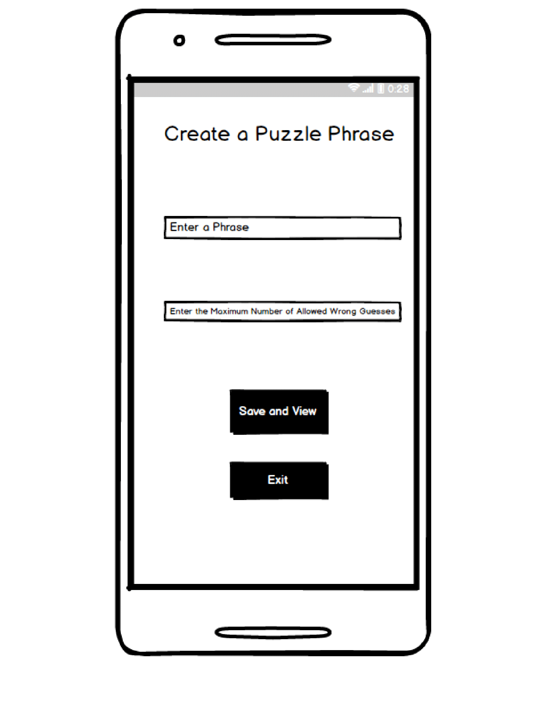

# Design Document

**Author**: \<ahegde39\> \<Yuhao Lan\>

## 1 Design Considerations

### 1.1 Assumptions

- *Background and Assumptions: Wheel of Fortune is an intelligent word game that offers users ability to make money by using their intelligence and guessing abilities. We assume that the money used in the game is strictly for entertainment purposes and has no real life connection to actual money.*

- *Usage:  We are designing Wheel of Fortune system as Multiplayer Android game app. It enables the Players to play puzzles, create puzzles, create tournaments, join incomplete tournaments and view puzzle statistics.*

- *Operational environment:  This Android app can be developed on macOS, Windows OS or whichever OS supports Java and Android development and will use Java language in object oriented paradigm to create all the functionality.*

- *Software Dependencies: This app will be developed using Android Studio editor. All the developers will have to use the same edition of the software.*

- *Version Control: The project will use GitHub as its verion control and the base url will be https://github.gatech.edu/gt-omscs-se-2018spring/6300Spring18Team46/tree/master/GroupProject.*

- *Database: In android, we will have to use a local SQL Lite DB to have local persistence to store game related information.*

### 1.2 Constraints

- *The app will enable multiple Players to play the game locally, that is, only players on the same device will be able to share information.*

### 1.3 System Environment

- *Hardware environment: The app should be able to used on android phone or tablet with Android 6.0 (Marshmallow) OS running on it.* 

- *Software environment: This app will be developed using Android Studio editor 3.0.0 and above. Android studio will should use Android 6.0 (Marshmallow) emulator mandatorily. The application will be tested using Espresso, Barista or Android Studio Test Recorder. Java versions which can be used are 1.6, 1.7, or 1.8 (recommended). The following environment variables must be set locally: JAVA_HOME - example: /Library/Java/JavaVirtualMachines/jdk1.8.0_20.jdk/Contents/Home.*

## 2 Architectural Design

### 2.1 Component Diagram

- *The app has two main components i.e Application UI and Database. Application UI contains several modules like Create Puzzle, Play Puzzle, Create Tournament, Join Tournament, Show Statistics and Popups. Here the popups may contain any commands/buttons such as submit, confirm, reset etc. Other component Database has three modules which are Player table (which stores all the player info), Puzzle table (which stores all the puzzles created/available) and Tournament Table(which stores the number of Tournaments created or available). These two components are mutually connected to each other as Application UI needs the data from the Database and also Database fetch its results from Application UI.*

### 2.2 Deployment Diagram

- *Since the entire software component will be deployed on Android phones or tablets, there is no necessity of deployment diagram.*

## 3 Low-Level Design

### 3.1 Class Diagram

 

### 3.2 Other Diagrams

*<u>Optionally</u>, you can decide to describe some dynamic aspects of your system using one or more behavioral diagrams, such as sequence and state diagrams.*

Sequence Diagram

State Diagram

## 4 User Interface Design

