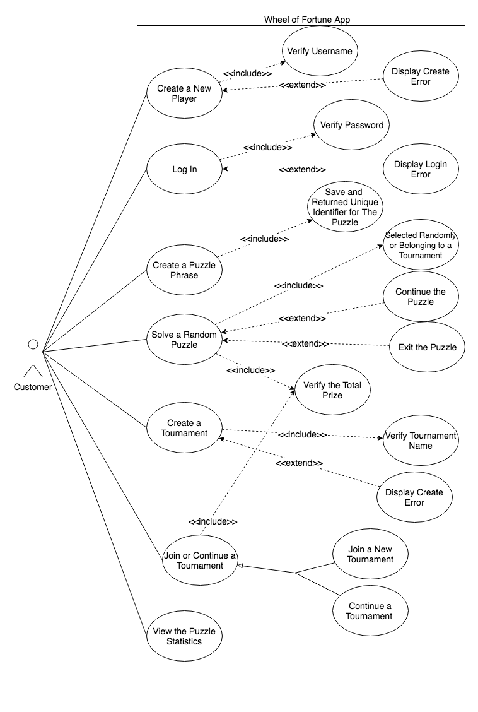

# Use Case Model

**Author**: \<ylan35\>

## 1 Use Case Diagram

## 2 Use Case Descriptions

- *Requirements: High-level description of what the use case must allow the user to do.*
- *Pre-conditions: Conditions that must be true before the use case is run.*
- *Post-conditions Conditions that must be true once the use case is run.*
- *Scenarios: Sequence of events that characterize the use case. This part may include multiple scenarios, for normal, alternate, and exceptional event sequences. These scenarios may be expressed as a list of steps in natural language or as sequence diagrams.*

-------------------------------------------------------------------------------------------------------------------------------------------------

*Use Case One: Create a New Player*

- *Requirements: the User will create a new player for logging in later. A new player includes: first name, last name, username, and email.*
- *Pre-conditions: the user must use the app*
- *Post-conditions: the user name must be unique.*
- *Scenarios: When creating a new player, a user will: (1) Enter the player’s first name. (2) Enter the player’s last name. (3) Enter the player’s desired username. (4) Enter the player’s email. (5) Submit the information.*

*Use Case Two: Log In*

- *Requirements: the User will use the username to login.*
- *Pre-conditions: the username must be correct.*
- *Post-conditions: the username must be correct.*
- *Scenarios: When the users login unsuccessfully, they will get an error message about "Username or Password Wrong". When the users login successfully, they will go to next page of the app, showing 5 choices: (1) create a puzzle phrase, (2) solve a random puzzle, (3) create a tournament, (4) join or continue a tournament, and (5) view the puzzle statistics.*

*Use Case Three: Create a Puzzle Phrase*

- *Requirements: the user will enter the phrase, maxium number of wrong guesses and save the phrase.*
- *Pre-conditions: the user must login.*
- *Post-conditions: the user must satisify the Puzzle Phrase requirements*
- *Scenarios: To create a puzzle, the player will: (1) Enter a phrase. (2) Enter the maximum number of allowed wrong guesses a user can make before losing the game, between 0 and 10. (3) Save and view the returned unique identifier for the puzzle. The puzzle may not be further edited after this point*

*Use Case Four: Solve a Random Puzzle*

- *Requirements: the user will start solving a puzzle, whether selected randomly or belonging to a tournament*
- *Pre-conditions: the user must login.*
- *Post-conditions: the user must create a puzzle.*
- *Scenarios:  the game will (1) Display the puzzle phrase, (2) Allow the player to choose, at every turn, whether to guess a consonant, buy a vowel, or solve the puzzle. (3) the player can continue this puzzle when exitting before (4) the player can exit puzzle without saving*

*Use Case Five: Create a Tournament*

- *Requirements: the user will create a tournament by entering the name and selecting a list of puzzles.*
- *Pre-conditions: the user must login.*
- *Post-conditions: the user must create a puzzle, and the name of tournament must be unique*
- *Scenarios: To create a tournament, a player will: (1) Select 1 to 5 puzzles from a list of puzzles that they have either created or already played. (2) Enter a name for the tournament.*

*Use Case Six: Join or Continue a Tournament*

- *Requirements: the user will join or continue a tournament by selecting the tournament created before.*
- *Pre-conditions: the user must login.*
- *Post-conditions: the user must create a puzzle and create a tournament.*
- *Scenarios: To play a tournament, a player can (1) select whether to join a new tournament, (2) continue a tournament he/she has already joined.*

*Use Case Seven: View the Puzzle Statistics*

- *Requirements: the player can see all the statistics information from this case.*
- *Pre-conditions: the user must login.*
- *Post-conditions: the user must finish playing some puzzles. If not, the statistics information will be zero.*
- *Scenarios: When a player opts to view the puzzle statistics, the game will show four pieces of information:
(1) The list of puzzles completed by that player with, for each puzzle, the prize the player won (including $0 for puzzles he/she quit or did not successfully solve). (2)The list of tournaments completed by that player with, for each tournament, the prize the player won. (3)The complete list of puzzles with, for each puzzle, the number of players who played it and the top prize won by a player for that puzzle, together with the username of that player. (4) The complete list of tournaments with, for each tournament, the number of players who completed the tournament and the top prize won by a player for that tournament, together with the username of that player.*

