# Wheel Of Fortune Android App
## USER MANUAL ##

*_Wheel Of Fortune_*

_Android App_

March 2018

**Revision Sheet**

|    Release    |       No.     |      Date     | Revision Description |
| ------------- | ------------- | ------------- | -------------------- |
|      Rev.     |       0       |    3/02/2018  | User Manual Template |
|      Final    |       1       |    3/09/2018  | User Manual          |

### A.        GENERAL INFORMATION ### 

### 1.1        System Overview ### 

An Android app for wheel of fortune game players:

•        A software system based on the Android Platform.

•        App name or title: Wheel Of Fortune

•        System code: Java

•        Development platform: Android Studio 3.0.1

**•        Test emulator: Nexus 6, Marshmallow API 23[Please use this emulator first to test our App]**

•        Operational status: **Release the final version**

### Project References ###

References that were used in preparation of this document in order of importance to the end user.

https://developer.android.com/studio/index.html

https://docs.google.com/document/d/1cIy72AtZMUmMDoJKb6KIuCnsnEfCyrU-ibi7ui9Z05s/edit

https://docs.google.com/document/d/1bgdJYNkXceRJolyhSRLx5vdyNWsdrokJpyuwRiI\_e3o/edit

### 1.2        Authorized Use Permission ###

Wheel Of Fortune app allows users to create their own account and use their account to login to play this game. When solving a random puzzle, each user will solve phrases that are randomly picked from other users. Each user can also see puzzle statistics: the list of puzzles completed by that player with, the list of tournaments completed by that player with, the complete list of puzzles with, for each puzzle and the complete list of tournaments with, for each tournament.

### 1.3        Organization of the Manual ### 

User&#39;s Manual v0.01.

### 1.4        Acronyms and Abbreviations ###

Provide a list of the acronyms and abbreviations used in this document and the meaning of each.

App:        Application

### B.        SYSTEM SUMMARY ###

### 2.1        System Configuration ###

Android is a mobile operating system developed by Google, based on a modified version of the Linux kernel and other open source software and designed primarily for touchscreen mobile devices such as smartphones and tablets. In addition, Google has further developed Android TV for televisions, Android Auto for cars, and Android Wear for wrist watches, each with a specialized user interface. Variants of Android are also used on game consoles, digital cameras, PCs and other electronics.

### 2.2        User Access Levels ###

The Primary user and family member and authorized user may be able to add and modify data and information.

### C.        GETTING STARTED ###

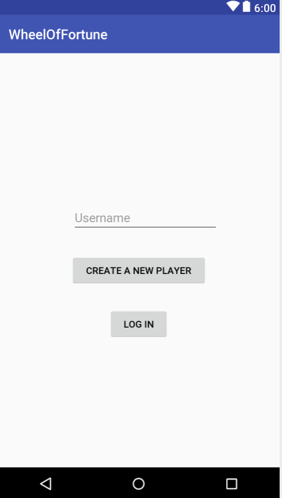

### 3.1        Logging Up ###

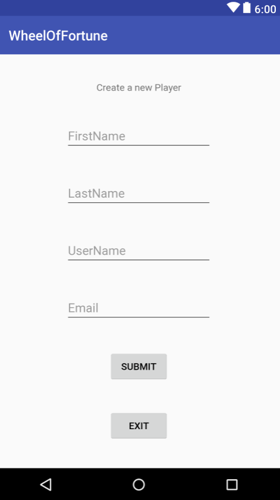

User needs to enter the username, first name, last name and email to log up. And the username must be unique.

### 3.2        Logging In ###

A username is required to login Wheel Of Fortune App.

### 3.3        System Menu ###

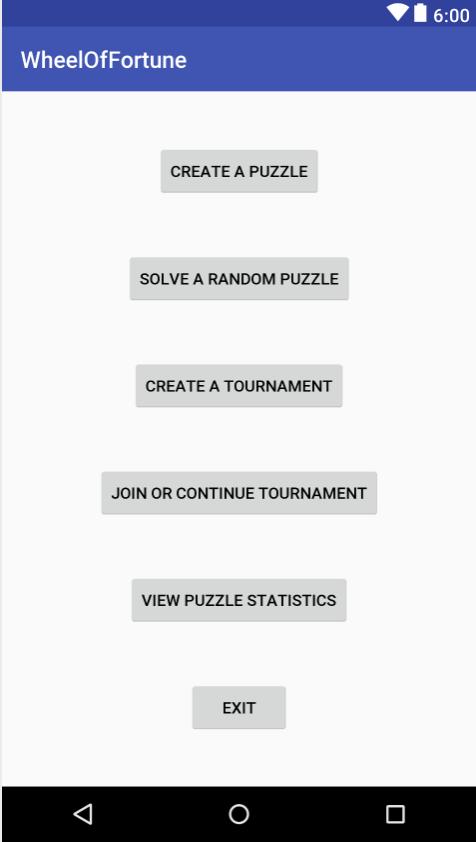

### 3.3.1        create a puzzle ###

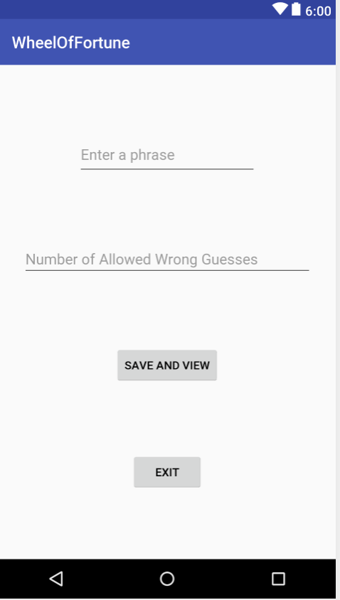

To create a puzzle, the player will: **(1) Enter a phrase**. **(2) Enter the maximum number of allowed wrong guesses** a user can make before losing the game, between 0 and 10. **(3) Save and view** the returned unique identifier for the puzzle.

### 3.3.2        solve a puzzle ###

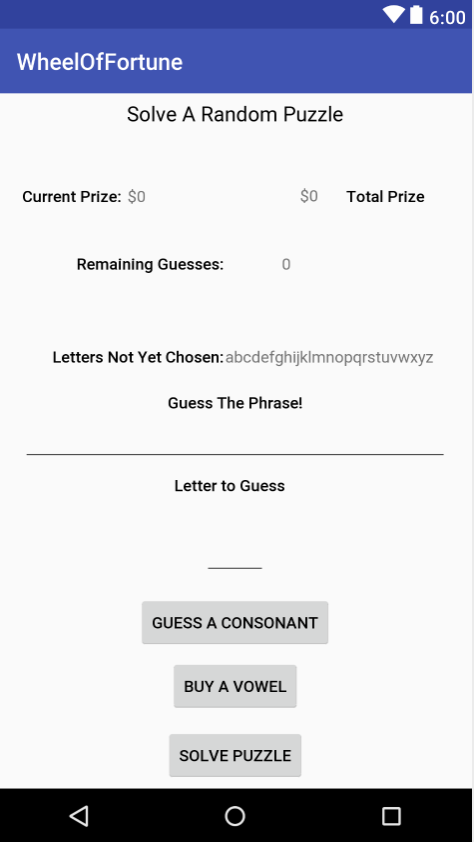

When a player starts solving a puzzle, whether selected randomly or belonging to a tournament, the game will: **Display the puzzle phrase** , where (1) all non-alphabetic characters (e.g., numbers or punctuation) are shown, and (2) regular letters are replaced by blanks. The game should also **display a list of all letters not yet chosen** , the total prize, with an initial value of $0, and **the remaining number of allowed wrong guesses** , initialized to the maximum number of allowed wrong guesses chosen by the puzzle creator.

The player can choose, at every turn, **whether to guess a consonant, buy a vowel, or solve the puzzle.**

**Guessing a consonant:** show the player a randomly chosen prize value that is a multiple of $100 and is between $100 and $1000. If the guess is correct (i.e., the consonant is in the puzzle), all the occurrences of the consonant in the puzzle will be revealed, and the total prize will be increased by the prize value times the number of such occurrences.

**Buying a vowel:** cost $300 of the player&#39;s total prize and will result in revealing all instances of that vowel in the puzzle.

**Solve the puzzle:** If a vowel or a consonant are guessed incorrectly (i.e., the guessed letter is not present in the puzzle), the remaining number of allowed wrong guesses is decremented. If the number goes below zero, the player gets a prize of $0 for that puzzle, and the game ends.

If a player selects to solve the puzzle and is successful, he/she will score $1000 for each letter not yet revealed, and his/her total prize will be recorded and associated to that puzzle and player. Conversely, if a player tries to solve the puzzle and is unsuccessful, he/she gets a prize of $0 for that puzzle, and the game ends.

### 3.3.3        create a tournament ###

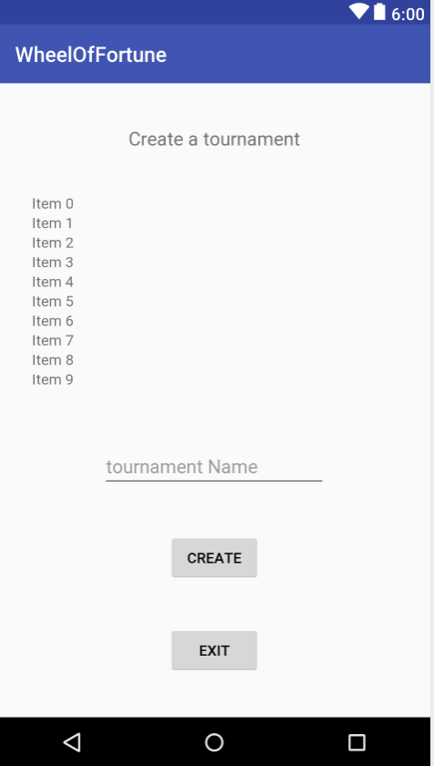

To create a tournament, a player will: (**1)Select 1 to 5 puzzles from a list of puzzles** that they have either created or already played. **(2)Enter a name for the tournament**.(3) Either receive a **confirmation that the tournament has been created** and return to the menu or **receive an error** if the tournament name is already taken and be offered the option to pick a different name. At this point, the tournament will be available for others to join.

### 3.3.4        join or continue a tournament ###

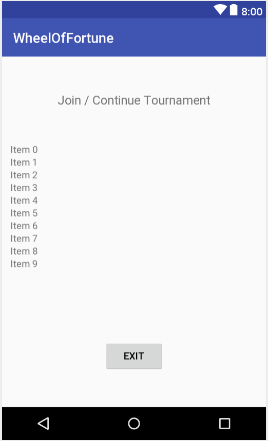

To play a tournament, a player can select whether to **join a new tournament** or **continue a tournament** he/she has already joined.

**Join a new tournament** : the game will show the player a list of tournaments that are currently available for him/her to join (i.e., all puzzles not created and not yet played by the player all tournaments that contain (1) no puzzles created by the player and (2) at least one puzzle not yet played by the player).

**Chooses a tournament:** the game will display the first puzzle in the tournament.

**Continue a tournament:** the game will show the player a list of tournaments they are currently playing that still have puzzles not completed by the player. When the player chooses a tournament in the list, the game will display the first unsolved puzzle in that tournament.

After a player completes the last puzzle in a tournament, the tournament ends (for that player), and the game stores the overall tournament prize of the player, which is the sum of the player&#39;s total prizes in all the puzzles in the tournament.

### 3.3.5        view puzzle statistics ###

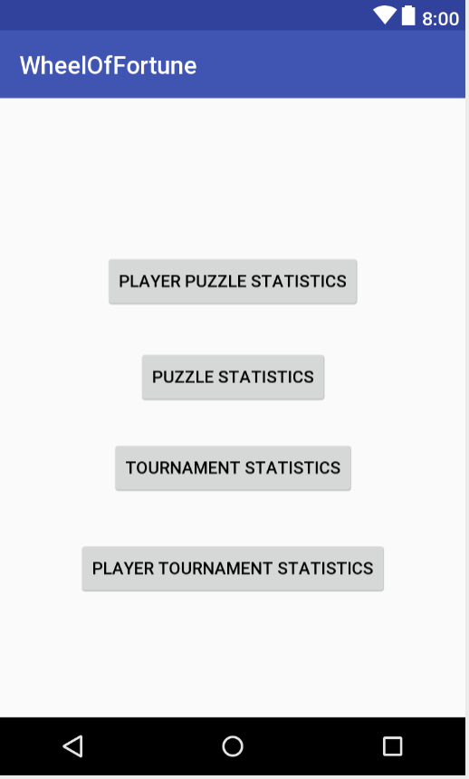

When a player opts to view the puzzle statistics, the game will show four pieces of information:

**1. The list of puzzles completed by that player with** , for each puzzle, the prize the player won (including $0 for puzzles he/she quit or did not successfully solve).

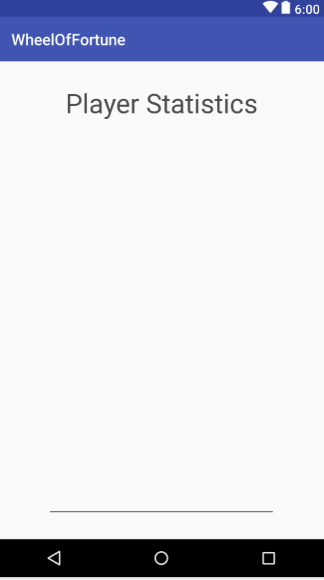

**2. The complete list of puzzles with, for each puzzle** , (1) the number of players who played it and (2) the top prize won by a player for that puzzle, together with the username of that player.

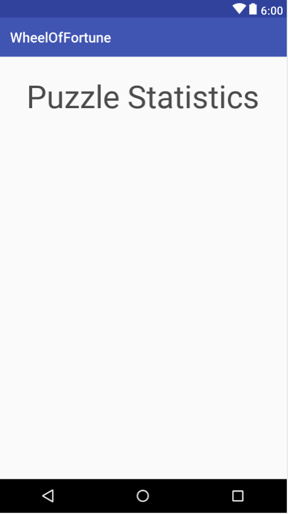

**3. The list of tournaments completed by that player with** , for each tournament, the prize the player won.

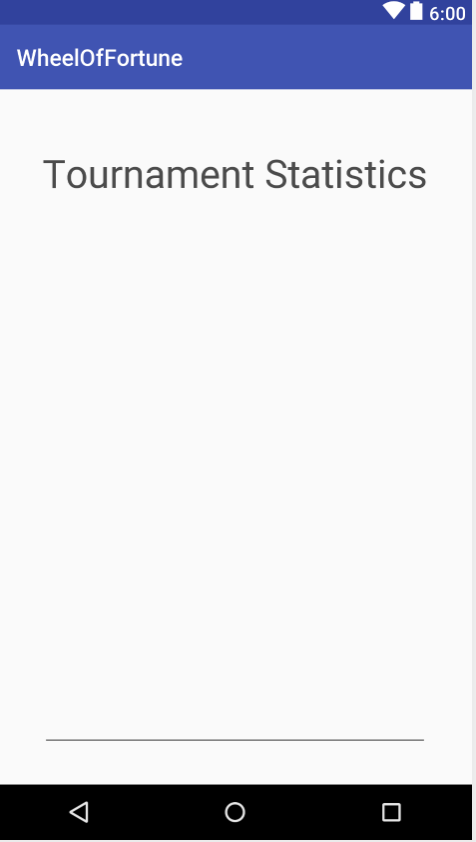

**4. The complete list of tournaments with, for each tournament** , (1) the number of players who completed the tournament and (2) the top prize won by a player for that tournament, together with the username of that player.

**3.4        Exit System or Current Page**

Click on Exit button.
